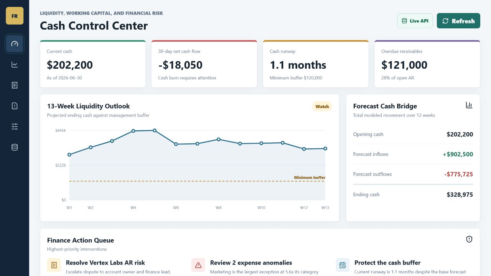

# Finance Cash Flow & Risk AI

An end-to-end FP&A and treasury analytics portfolio project for finance teams that need earlier visibility into liquidity pressure, slow collections, and unusual spending. The application combines a 13-week cash forecast, receivables risk scoring, robust expense anomaly detection, scenario planning, validated finance data ingestion, and Power BI-ready reporting assets.



## Business Problem

Growing companies often manage cash in disconnected bank exports, ERP reports, and spreadsheet forecasts. Finance leaders need to answer:

- Will cash remain above the minimum operating buffer over the next 13 weeks?
- Which customer invoices require immediate collection action?
- Which expenses are materially outside normal category behavior?
- How will revenue pressure, rising costs, slower collections, or one-time investments affect liquidity?

## Solution

- Python analytics engine with explicit cash roll-forward checks.
- FastAPI endpoints for liquidity KPIs, weekly forecast, AR risk, anomalies, and scenarios.
- React/TypeScript CFO workspace with six functional views.
- Adjustable downside scenario planner that recalculates the underlying weekly model.
- Validated two-file CSV ingestion for transactions and invoices.
- Auditable Excel finance input pack with assumptions, checks, and source tables.
- Power BI semantic model requirements and production-style DAX measures.
- Automated Python tests, Ruff linting, and frontend builds through GitHub Actions.

## Tech Stack

- Python 3.12, FastAPI, Pydantic, pytest
- React 19, TypeScript, Vite, lucide-react
- CSV/Excel finance inputs with PostgreSQL-ready service boundaries
- Power BI model and DAX design
- Docker and GitHub Actions

## Dashboard Views

1. **Cash Control Center** - liquidity KPIs, 13-week curve, cash bridge, and action queue.
2. **13-Week Forecast** - weekly inflows, outflows, ending cash, and buffer exceptions.
3. **Receivables Risk** - searchable collection worklist with explainable risk scores.
4. **Expense Anomalies** - robust median/MAD-based outflow exceptions.
5. **Scenario Planner** - revenue, expense, collection delay, and one-time outflow stress tests.
6. **Finance Data** - validated transaction/invoice uploads and model assumptions.

## Quick Start

### API

```powershell
cd backend
python -m venv .venv
.venv\Scripts\activate
pip install -r requirements.txt
python -m uvicorn app.main:app --reload --port 8000
```

API documentation: `http://127.0.0.1:8000/docs`

### Frontend

```powershell
cd frontend
npm install
npm run dev
```

Dashboard: `http://localhost:5173`

### Tests

```powershell
$env:PYTHONPATH="backend"
python -m pytest backend/tests
cd frontend
npm run build
```

## Finance Model

The sample input workbook is stored at `data/templates/finance_input_template.xlsx`. It includes:

- Separate assumptions, transactions, invoices, checks, and summary sheets.
- Blue-font editable assumptions and formula-driven checks.
- Explicit model metadata, currency, as-of date, scenario, and owner.
- A visible `MODEL STATUS: PASS` control.

The matching application inputs are stored in `data/sample/`.

## Analytics Methods

- **Current cash:** opening cash plus signed actual transaction flows through the as-of date.
- **13-week forecast:** recurring eight-week operating baseline plus scheduled transactions and expected invoice collections.
- **Runway:** current cash divided by average monthly outflows over the trailing 90 days.
- **AR risk:** overdue aging, customer balance concentration, and dispute status.
- **Expense anomalies:** category median and median absolute deviation, with a multiple-of-median fallback.
- **Scenario analysis:** recalculates weekly inflows, expenses, collection timing, and one-time cash events.

## Project Structure

```text
backend/       FastAPI application, validation, analytics services, and tests
frontend/      Interactive React CFO dashboard
data/          Sample CSVs, ignored imported data, and Excel template
powerbi/       Semantic model, dashboard requirements, and DAX measures
docs/          Architecture, data dictionary, model card, and resume bullets
notebooks/     Exploratory analysis roadmap
.github/       CI workflow
```

## Portfolio Highlights

- Built a reconciled 13-week liquidity model with scenario-aware cash roll-forwards.
- Prioritized customer collections using explainable invoice risk signals.
- Detected unusual spend with robust statistics suited to skewed finance data.
- Delivered an end-to-end workflow spanning input controls, analytics, APIs, responsive UI, testing, documentation, and BI design.

## Roadmap

- Add PostgreSQL persistence and role-based authentication.
- Connect Plaid/Open Banking and ERP-specific adapters.
- Add probabilistic invoice collection and cash confidence intervals.
- Track forecast accuracy and scenario variance over time.
- Publish a Power BI PBIP report and deploy the full stack to cloud hosting.