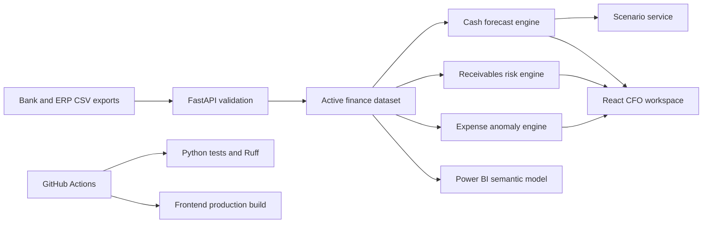

# Architecture

## Ownership Boundaries

- `services/analytics.py` owns deterministic finance calculations.
- `services/data_sources.py` owns input validation and active dataset persistence.
- `api/routes.py` maps typed contracts to service calls.
- React components own presentation and user interactions only.
- Power BI assets define an independent executive reporting layer.

## Production Evolution

Replace local CSV persistence with object storage plus PostgreSQL metadata. Run ingestion and forecasting as background jobs, store scenario versions, add SSO/RBAC, and publish model health/forecast accuracy telemetry.